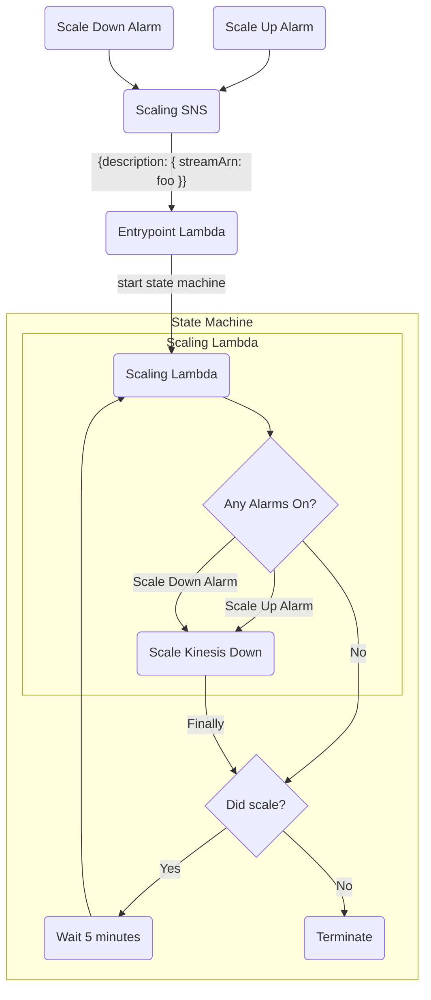

# Kinesis Autoscaling
This directory contains the cdk constructs used to auto-scale kinesis streams.

## Flow

```mermaid
flowchart TD
    SNS(Scaling SNS)
    Lambda1(Entrypoint Lambda)
    Lambda2(Scaling Lambda)
    Wait(wait x time)
    %% Decision1{Needs scaling?}
    Decision2{Did scale?}

    AlarmUp(Scale Up Alarm) --> SNS
    AlarmDown(Scale Down Alarm) --> SNS
    SNS -- "{description: { streamArn: foo }}" --> Lambda1
    Lambda1 -- "start state machine" --> Lambda2

    subgraph State Machine
    subgraph Scaling Lambda
    
    Lambda2 --> f{Any Alarms On?}
    f -->|Scale Up Alarm| s(Scale Kinesis Up)
    f -->|Scale Down Alarm| s(Scale Kinesis Down)
    end
    f -->|No| Decision2
    s -->|Finally| Decision2

    Decision2 -->|Yes| Wait(Wait 5 minutes)
    Decision2 -->|No| End(Terminate)
    Wait --> Lambda2

    end
```